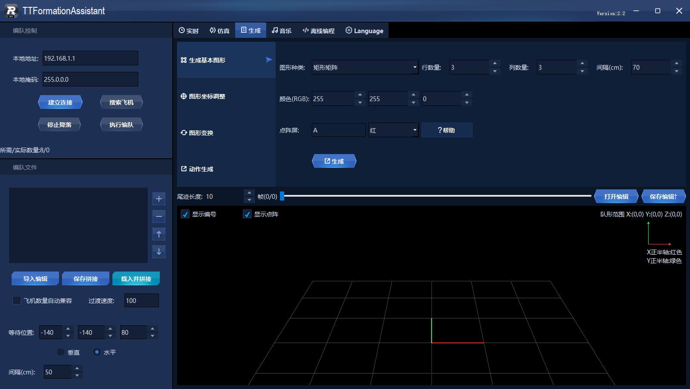
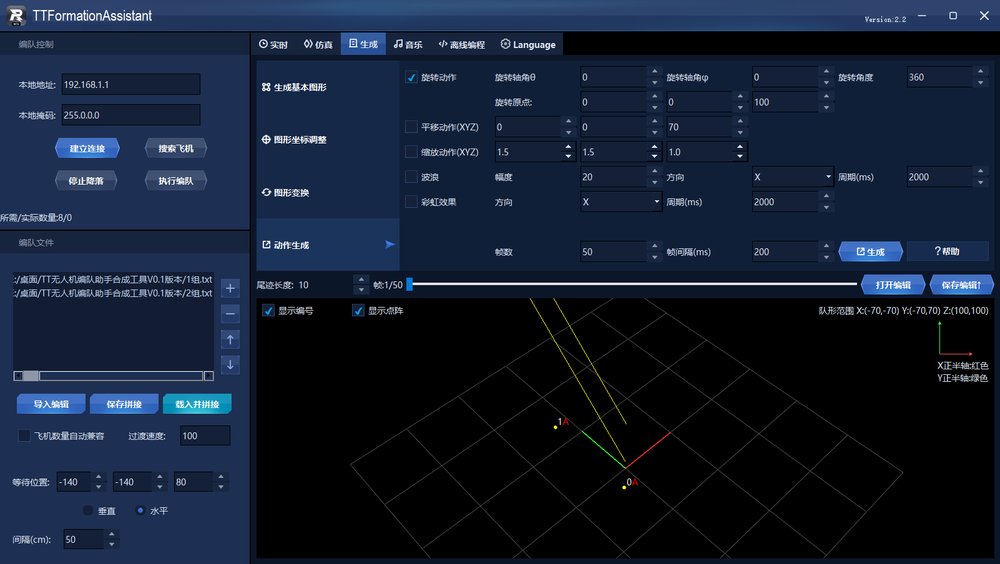
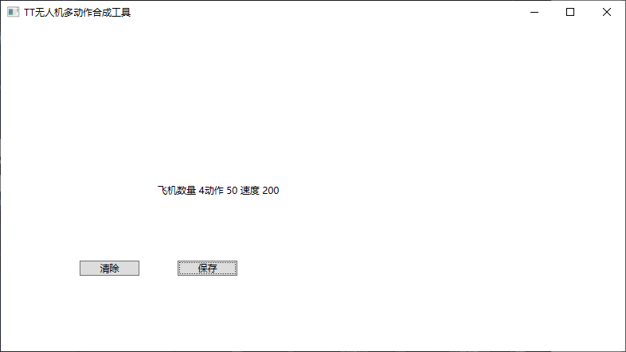
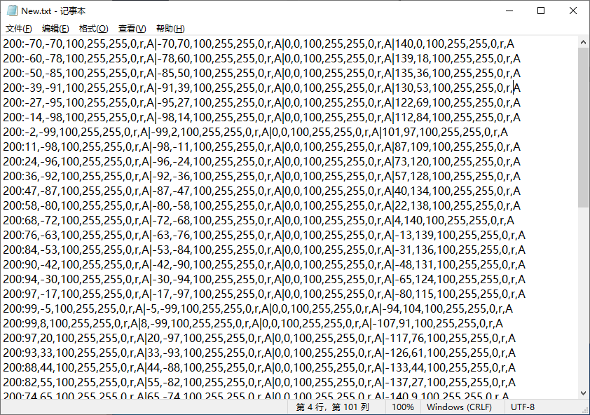
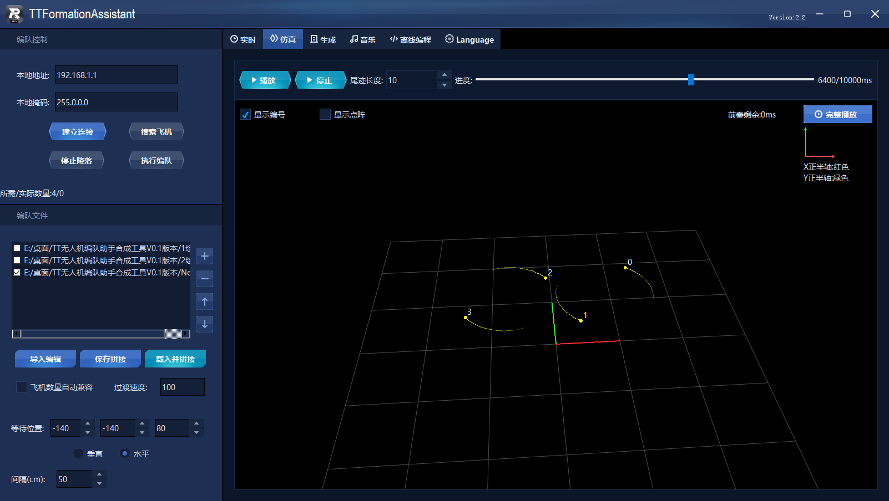

## TT无人机编队助手合成工具V0.1版本使用说明

TT无人机编队助手在使用和编辑时可以极大方便我们的使用可以快速构建起一套编队动作，但是每一个动作都只能是固定的无法制作出类似2组飞机互绕飞行的效果所以这里就写了一个小工具通过分别建立两组动作再使用合成工具合成实现更复杂有趣的编队动作。

### 1.打开编队助手

### 2.创建两个飞机并设计简单动作

在编辑时需要计算以下动作相互旋转时飞机是否会发生重合相撞

### 3.找到生成的两组动作拖拽至合成工具中并保存合成结果

观察合成后的NEW文件就会发现两组动作已经合二为一了导入编队助手中预览合成效果即可

最简单的一个两组飞机互绕飞行的动作就做好了还可以加入其他创意比如9机金字塔形状上下颠倒旋转飞行等

### 4.使用注意事项

需要每一组编队动作的帧数与帧速度都保持一致如果不一致合成工具将不会进行合成。

